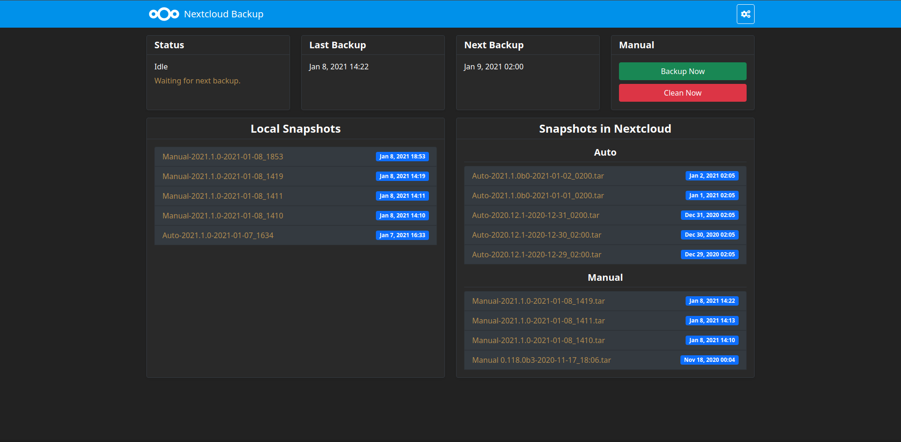

# Home Assistant Add-ons: Nextcloud Backup

[![GitHub Release][releases-shield]][releases]
![Project Stage][project-stage-shield]
[![License][license-shield]](LICENSE)

![Supports aarch64 Architecture][aarch64-shield]
![Supports amd64 Architecture][amd64-shield]
![Supports armhf Architecture][armhf-shield]
![Supports armv7 Architecture][armv7-shield]
![Supports i386 Architecture][i386-shield]

![Project Maintenance][maintenance-shield]

[![Community Forum][forum-shield]][forum]

[![Buy me a coffee][buymeacoffee-shield]][buymeacoffee]

Easily backup your Home Assistant snapshots to Nextcloud

## About

Easily backup your Home Assistant snapshots to Nextcloud.
Auto backup can be configured via the web interface.
### Features

- __Auto Backup__ : Configure this add-on to automatically backup your HassIO instance
- __Selective Backup__ : You can specify witch folder and add-on you want to backup.
- __Password protected Backup__ : this add-on can use the Home Assistant snapshot encryption.
- __Auto Clean__ : You can specify the maximum number of local snapshots and (__ONLY__) auto backed-up snapshots.
- __Restore__ : Upload backed-up snapshot to Home assistant.
- __Auto Stop__ : This addon can stop addons before backup and restart them after backup 
- __Web UI__ : All the configuration is based on an easy-to-use web interface, no yaml needed.
> __Info:__
> Auto Clean is executed after every upload and every day at 00h30

## Installation

The installation of this add-on is pretty straightforward and not different in
comparison to installing any other Hass.io add-on.

1. [Add our Home Assisant add-ons repository][repository] to your HassOS instance.
1. Install the "Nextcloud Backup" add-on.
1. Start the "Nextcloud Backup" add-on
1. Check the logs of the "Nextcloud Backup" add-on to see if everything went well.
1. Open the web UI for the "Nextcloud Backup" to configure the add-on.

> **NOTE**: Do not add this repository to HassOS, please use: `https://github.com/Sebclem/sebclem-hassio-addon-repository`.

## Configuration
The configuration documention can be found [here][config_doc]

## Support

Got questions?

You have several options to get them answered:

- The [Home Assistant Discord chat server][discord-ha] for general Home
  Assistant discussions and questions.
- The Home Assistant [Community Forum][forum].
- Join the [Reddit subreddit][reddit] in [/r/homeassistant][reddit]

You could also [open an issue here][issue] GitHub.

<!-- ## Contributing

This is an active open-source project. We are always open to people who want to
use the code or contribute to it.

We have set up a separate document containing our
[contribution guidelines](CONTRIBUTING.md).

Thank you for being involved! :heart_eyes: -->

## Authors & contributors

The original setup of this repository is by [Sebastien Clement][Sebclem].

For a full list of all authors and contributors,
check [the contributor's page][contributors].

## License

MIT License

Copyright (c) 2021 Sébastien Clément

Permission is hereby granted, free of charge, to any person obtaining a copy
of this software and associated documentation files (the "Software"), to deal
in the Software without restriction, including without limitation the rights
to use, copy, modify, merge, publish, distribute, sublicense, and/or sell
copies of the Software, and to permit persons to whom the Software is
furnished to do so, subject to the following conditions:

The above copyright notice and this permission notice shall be included in all
copies or substantial portions of the Software.

THE SOFTWARE IS PROVIDED "AS IS", WITHOUT WARRANTY OF ANY KIND, EXPRESS OR
IMPLIED, INCLUDING BUT NOT LIMITED TO THE WARRANTIES OF MERCHANTABILITY,
FITNESS FOR A PARTICULAR PURPOSE AND NONINFRINGEMENT. IN NO EVENT SHALL THE
AUTHORS OR COPYRIGHT HOLDERS BE LIABLE FOR ANY CLAIM, DAMAGES OR OTHER
LIABILITY, WHETHER IN AN ACTION OF CONTRACT, TORT OR OTHERWISE, ARISING FROM,
OUT OF OR IN CONNECTION WITH THE SOFTWARE OR THE USE OR OTHER DEALINGS IN THE
SOFTWARE.

[aarch64-shield]: https://img.shields.io/badge/aarch64-yes-green.svg
[amd64-shield]: https://img.shields.io/badge/amd64-yes-green.svg
[armhf-shield]: https://img.shields.io/badge/armhf-yes-green.svg
[armv7-shield]: https://img.shields.io/badge/armv7-yes-green.svg
[buymeacoffee-shield]: https://www.buymeacoffee.com/assets/img/guidelines/download-assets-sm-2.svg
[buymeacoffee]: https://www.buymeacoffee.com/seb6596
[Sebclem]: https://github.com/Sebclem
[discord-ha]: https://discord.gg/c5DvZ4e
[forum-shield]: https://img.shields.io/badge/community-forum-brightgreen.svg
[forum]: https://community.home-assistant.io/
[i386-shield]: https://img.shields.io/badge/i386-yes-green.svg
[issue]: https://github.com/Sebclem/hassio-nextcloud-backup/issues
[license-shield]: https://img.shields.io/github/license/Sebclem/hassio-nextcloud-backup.svg
[maintenance-shield]: https://img.shields.io/maintenance/yes/2021.svg
[project-stage-shield]: https://img.shields.io/badge/project%20stage-Beta-red.svg
[reddit]: https://reddit.com/r/homeassistant
[releases-shield]: https://img.shields.io/github/release/Sebclem/hassio-nextcloud-backup.svg?include_prereleases
[releases]: https://github.com/Sebclem/hassio-nextcloud-backup/releases
[repository]: https://github.com/Sebclem/sebclem-hassio-addon-repository
[contributors]: https://github.com/Sebclem/hassio-nextcloud-backup/graphs/contributors
[semver]: https://semver.org/spec/v2.0.0.htm
[config_doc]: https://github.com/Sebclem/hassio-nextcloud-backup/blob/master/nextcloud_backup/DOCS.md

